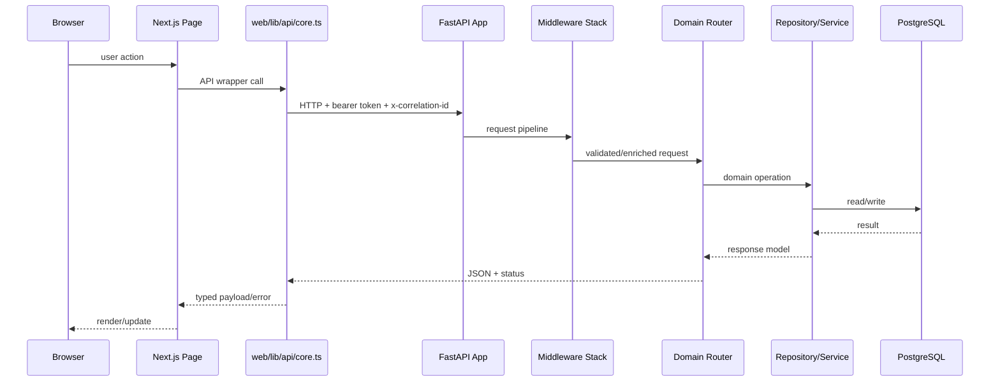

# System Architecture

## Overview
NEXA PLATFORM is a monorepo modular-monolith where `apps/api` and `apps/web` are developed and run together via Docker Compose, while `packages/shared` and `packages/ui` provide reusable contracts/components.

Source references:
- `README.md`
- `package.json`
- `pnpm-workspace.yaml`
- `infra/docker-compose.yml`

## Component Diagram
```mermaid
flowchart TB
	subgraph Frontend
		WEB[apps/web Next.js App Router]
		SHARED[@nexa/shared]
		UI[@nexa/ui]
	end

	subgraph Backend
		API[apps/api FastAPI]
		ROUTES[api/routes + domain routers]
		SECURITY[platform/security RLS/FLS/policies]
		EVENTS[event_bus + domain events]
		METRICS[Prometheus metrics]
		OTEL[OpenTelemetry instrumentation]
	end

	subgraph Data
		PG[(PostgreSQL)]
		REDIS[(Redis)]
	end

	WEB --> API
	WEB --> SHARED
	WEB --> UI
	API --> ROUTES
	ROUTES --> SECURITY
	ROUTES --> EVENTS
	API --> METRICS
	API --> OTEL
	API --> PG
	API --> REDIS
```

Diagram references:
- `apps/web/app/layout.tsx`
- `apps/web/lib/api/core.ts`
- `apps/api/app/main.py`
- `apps/api/app/api/routes.py`
- `apps/api/app/platform/security/*.py`
- `apps/api/app/metrics.py`
- `apps/api/app/otel.py`

## Request Lifecycle


Lifecycle references:
- `apps/web/lib/api/core.ts`
- `apps/api/app/main.py`
- `apps/api/app/middleware/*.py`
- `apps/api/app/api/routes.py`
- `apps/api/app/**/repository.py`

## Deployment/Runtime Assumptions
- Local-first orchestration with Docker Compose (`infra/docker-compose.yml`).
- API runs with code reload (`poetry run uvicorn ... --reload`) in compose.
- Web runs via `pnpm --filter @nexa/web dev` in compose.
- Migrations managed through Alembic (`apps/api/alembic`).

Source references:
- `infra/docker-compose.yml`
- `package.json`
- `apps/api/alembic/env.py`
- `apps/api/alembic.ini`

## Notes
- Existing database reference remains in `docs/database.md`.
