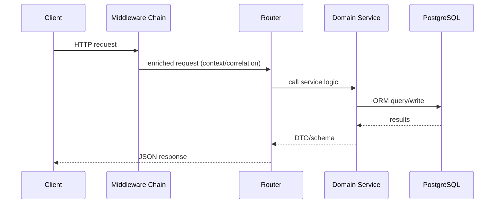

# Module: api

## 1. Overview
The `api` module is the FastAPI backend that exposes system, authz, CRM, catalog, revenue, subscription, billing, payments, ledger, and finance-reporting endpoints.

Runtime context:
- Python server process (Uvicorn/FastAPI)
- Background-friendly event-driven hooks inside process lifecycle

Source references:
- `apps/api/app/main.py`
- `apps/api/app/api/routes.py`
- `apps/api/pyproject.toml`

## 2. Folder Structure & Key Files
- `apps/api/app/main.py` — app bootstrap, middleware registration, policy backend selection, OTEL instrumentation, event subscriptions.
- `apps/api/app/api/routes.py` — top-level router composition and `/health`, `/me`, `/metrics`.
- `apps/api/app/core/` — config, DB session/base, auth parsing, permission helper, request context middleware.
- `apps/api/app/crm/` — CRM API, schemas, repositories, search/import/export.
- `apps/api/app/business/*/` — bounded domains:
  - `catalog`, `revenue`, `subscription`, `billing`, `payments`, `reporting/finance`.
- `apps/api/app/platform/ledger/` — ledger accounts + journal entries.
- `apps/api/app/platform/security/` — policy backend, RLS/FLS checks, auth context abstraction.
- `apps/api/alembic/` — migration environment + revision scripts.
- `apps/api/tests/` — API and service tests by domain/security/observability.

## 3. Public Interfaces
### Core system/auth
- `GET /health` — liveness and environment metadata (`apps/api/app/api/routes.py`).
- `GET /me` — returns subject and roles from decoded JWT/guest fallback (`apps/api/app/api/routes.py`, `apps/api/app/core/auth.py`).
- `GET /metrics` — Prometheus payload, gated by `system.metrics.read` role and `METRICS_ENABLED` (`apps/api/app/api/routes.py`, `apps/api/app/metrics.py`).

### Domain route groups (router files)
- Authz admin: `apps/api/app/authz/api.py`.
- CRM: `apps/api/app/crm/api.py`.
- Catalog: `apps/api/app/business/catalog/api.py`.
- Revenue: `apps/api/app/business/revenue/api.py`.
- Subscription: `apps/api/app/business/subscription/api.py`.
- Billing: `apps/api/app/business/billing/api.py`.
- Payments: `apps/api/app/business/payments/api.py`.
- Ledger: `apps/api/app/platform/ledger/api.py`.
- Finance reports: `apps/api/app/business/reporting/finance/api.py`.

Representative endpoint examples (method + path):
- `POST /api/catalog/products` (`apps/api/app/business/catalog/api.py`)
- `POST /api/revenue/quotes/{quote_id}/create-order` (`apps/api/app/business/revenue/api.py`)
- `POST /api/subscriptions/{subscription_id}/activate` (`apps/api/app/business/subscription/api.py`)
- `POST /api/billing/invoices/{invoice_id}/mark-paid` (`apps/api/app/business/billing/api.py`)
- `POST /api/payments/{payment_id}/allocate` (`apps/api/app/business/payments/api.py`)
- `POST /api/ledger/journal-entries/{entry_id}/reverse` (`apps/api/app/platform/ledger/api.py`)

Auth requirements:
- JWT decode from `Authorization: Bearer` if present, fallback to guest (`apps/api/app/core/auth.py`).
- Permission checks via role/permission lists and policy backend enforcement (`apps/api/app/core/rbac.py`, `apps/api/app/platform/security/policies.py`).

## 4. Data Model
ORM models are domain-scoped and share `Base` from `apps/api/app/core/database.py`.

Key model groups:
- CRM entities and workflow/custom fields (`apps/api/app/crm/models.py`)
- Authz roles/permissions/policy tables (`apps/api/app/authz/models.py`)
- Catalog/revenue/subscription/billing/payments (`apps/api/app/business/*/models.py`)
- Ledger journal/accounting (`apps/api/app/platform/ledger/models.py`)
- Audit log model (`apps/api/app/models/audit.py`)

Migrations:
- Alembic env imports all model modules for metadata (`apps/api/alembic/env.py`).
- Revisions in `apps/api/alembic/versions/` include CRM, authz, ledger, catalog, revenue, subscription, billing, and payments series.

Constraints/relationships:
- Enforced primarily through SQLAlchemy model definitions and domain services (`apps/api/app/**/models.py`, `apps/api/app/**/service.py`).

## 5. Execution & Control Flow
Core flow examples:
1. API request enters middleware chain (correlation, request logging, request context, rate limit) then router dispatch.
2. Revenue lifecycle transitions quote → order → contract via revenue domain endpoints.
3. Subscription activation/renewal emits billing event hook and triggers invoice generation path.
4. Metrics endpoint validates auth role and feature flag before payload generation.

Flow references:
- `apps/api/app/main.py`
- `apps/api/app/middleware/*.py`
- `apps/api/app/api/routes.py`
- `apps/api/app/business/*/service.py`

## 6. Configuration
Primary config class:
- `Settings` in `apps/api/app/core/config.py`.

Key env-driven settings:
- Runtime/app: `APP_NAME`, `APP_ENV`, `APP_DEBUG`, `API_PORT`
- Data: `DATABASE_URL`, `REDIS_URL`
- Auth: `JWT_SECRET`, `JWT_ALGORITHM`
- Runtime toggles: `METRICS_ENABLED`, `OTEL_ENABLED`, rate-limit and workflow guardrail values
- Policy backend: `AUTHZ_POLICY_BACKEND`, `AUTHZ_DEFAULT_ALLOW`

Source references:
- `apps/api/app/core/config.py`
- `apps/api/.env.example`
- `apps/api/pyproject.toml`

## 7. Security & Authorization
- Authentication: JWT decode with fallback guest identity (`apps/api/app/core/auth.py`).
- Route-level role checks: `require_permissions` helper (`apps/api/app/core/rbac.py`).
- Policy backend options:
  - In-memory policy matching (`InMemoryPolicyBackend`)
  - DB-backed policy resolution (`DbPolicyBackend`)
  (`apps/api/app/platform/security/policies.py`).
- RLS/FLS enforcement helpers used by repositories:
  - `apply_rls_filter`, `validate_rls_read_scope`, `validate_rls_write` (`apps/api/app/platform/security/rls.py`)
  - `apply_fls_read`, `validate_fls_write` (`apps/api/app/platform/security/fls.py`)
- Audit hooks for denied actions and field masking (`apps/api/app/audit.py`, `apps/api/app/platform/security/*.py`).

## 8. Observability
- Structured JSON logs + correlation-id injection (`apps/api/app/logging.py`).
- Prometheus counters/histograms for HTTP/jobs/authz/FLS/RLS/ledger (`apps/api/app/metrics.py`).
- OTEL setup and FastAPI instrumentation with optional OTLP exporter (`apps/api/app/otel.py`).
- Request middleware captures timing and correlation propagation (`apps/api/app/middleware/request_logging.py`, `apps/api/app/middleware/correlation_id.py`).

## 9. Testing
Test structure:
- Domain/API tests: `apps/api/tests/test_*_api.py`
- Service tests: `apps/api/tests/test_*_service.py`
- Security tests: RLS/FLS/authz (`test_rls_security.py`, `test_fls_security.py`, `test_authz_*`)
- Observability tests: `test_metrics_endpoint.py`, `test_otel_spans.py`, `test_logging_context.py`

How to run:
- In Docker: root script `pnpm api:test` (`package.json`)
- Direct: `poetry run pytest` within `apps/api` (`apps/api/pyproject.toml`)

## 10. Troubleshooting
1. **`/metrics` returns 404** — check `METRICS_ENABLED` and `apps/api/app/core/config.py`.
2. **`/metrics` returns 403** — token roles missing `system.metrics.read` (`apps/api/app/api/routes.py`).
3. **Startup import errors for optional validation libs** — confirm `email-validator` / `python-multipart` in `apps/api/pyproject.toml` and lockfile.
4. **Unexpected guest identity** — inspect JWT secret/algorithm and `Authorization` header handling (`apps/api/app/core/auth.py`).
5. **RLS denied reads/writes** — trace `apps/api/app/platform/security/rls.py` and audit records.
6. **FLS masked or missing fields** — inspect `apps/api/app/platform/security/fls.py` + policy grants.
7. **Rate limit 429 on CRM mutations** — check `apps/api/app/middleware/rate_limit.py` and `RATE_LIMIT_*` settings.
8. **Migrations not applying expected tables** — verify `apps/api/alembic/env.py` imports all model packages.
9. **OTEL no spans exported** — verify `OTEL_ENABLED` and optional exporter env vars (`apps/api/app/otel.py`).
10. **Policy behavior differs local/prod** — check backend selection logic in `apps/api/app/main.py`.

## 11. Open Questions / TODO
- Mapper conflict observed in local tests (`RevenueQuote` path ambiguity) appears to involve model registration overlap; validate whether `apps/api/app/revenue/models.py` legacy models are intentionally coexisting with `apps/api/app/business/revenue/models.py`.
- JWT auth currently falls back to guest instead of hard fail on decode error (`apps/api/app/core/auth.py` TODO comment); confirm intended production behavior.
- `authz_default_allow` defaults to permissive mode; confirm deployment hardening baseline (`apps/api/app/core/config.py`, `apps/api/app/main.py`).
