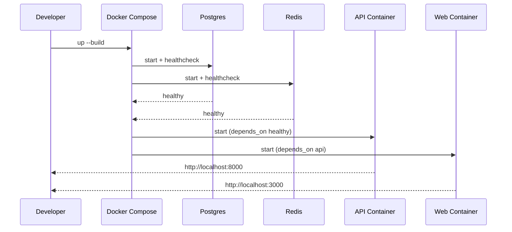

# Module: infra

## 1. Overview
The `infra` module defines local runtime orchestration for the monorepo using Docker Compose and lightweight Dockerfiles for API and web containers.

Runtime context:
- Container orchestration (development/local)
- Service composition for API + Web + Postgres + Redis (+ optional pgAdmin)

Source references:
- `infra/docker-compose.yml`
- `infra/docker/api.Dockerfile`
- `infra/docker/web.Dockerfile`

## 2. Folder Structure & Key Files
- `infra/docker-compose.yml` — services, networks/volumes, ports, healthchecks, dependency ordering.
- `infra/docker/api.Dockerfile` — Python base + Poetry installation + working directory.
- `infra/docker/web.Dockerfile` — Node base + pnpm activation + working directory.

## 3. Public Interfaces
Primary operator entry points are repo scripts and compose commands:
- `pnpm dev` / `pnpm dev:down` / `pnpm dev:clean` (`package.json`)
- Direct compose usage with `infra/docker-compose.yml`

Published runtime ports:
- API: `8000`
- Web: `3000`
- Postgres: `5432`
- Redis: `6379`
- pgAdmin profile: `5050`

Source references:
- `package.json`
- `infra/docker-compose.yml`

## 4. Data Model
No application domain data model lives in `infra`; it provisions data services used by API.

Relevant persistence wiring:
- Postgres volume: `postgres_data`
- Web dependency cache volume: `web_node_modules`

Source references:
- `infra/docker-compose.yml`

## 5. Execution & Control Flow
Core startup flow:
1. Compose builds `infra-api` and `infra-web` images.
2. Postgres and Redis start and become healthy.
3. API container installs dependencies and starts Uvicorn.
4. Web container installs dependencies and starts Next dev server.

Flow references:
- `infra/docker-compose.yml`
- `package.json`

## 6. Configuration
Compose-level env variables include:
- `POSTGRES_DB`, `POSTGRES_USER`, `POSTGRES_PASSWORD`, `POSTGRES_PORT`
- `REDIS_PORT`
- `API_PORT`, `WEB_PORT`
- `NEXT_PUBLIC_API_BASE_URL`

Source references:
- `.env.example`
- `infra/docker-compose.yml`

## 7. Security & Authorization
- Secrets are provided via env files and compose environment; defaults in examples are development-grade.
- Compose uses static dev credentials for local stack bootstrap.
- App-level authz/authn is implemented in `apps/api`, not directly in `infra`.

Source references:
- `.env.example`
- `apps/api/.env.example`
- `infra/docker-compose.yml`

## 8. Observability
- Healthchecks configured for Postgres and Redis at compose level.
- API exposes `/health` and optional `/metrics` from app layer.
- Container logs are primary local observability channel.

Source references:
- `infra/docker-compose.yml`
- `apps/api/app/api/routes.py`

## 9. Testing
Infra does not have dedicated test suite in repository.

Validation is operational via:
- `pnpm dev` and service health checks.
- Application tests run inside API/web modules (`package.json`, `apps/api/pyproject.toml`, `apps/web/package.json`).

## 10. Troubleshooting
1. **Container exits during dependency install** — inspect `docker compose logs <service>` and lockfiles.
2. **API starts but import fails** — verify runtime dependencies in `apps/api/pyproject.toml`/`poetry.lock`.
3. **Web cannot reach API** — verify `NEXT_PUBLIC_API_BASE_URL` and exposed API port mapping.
4. **DB connection errors** — verify Postgres health and `DATABASE_URL` environment.
5. **Slow startup after clean** — expected while reinstalling Node/Python dependencies.

## 11. Open Questions / TODO
- No CI/CD deployment manifests are present in repo (`.github` missing); confirm intended deployment target and release pipeline location.
- Compose currently optimized for development (`--reload` in API, `next dev` in web); production container strategy should be documented separately.
