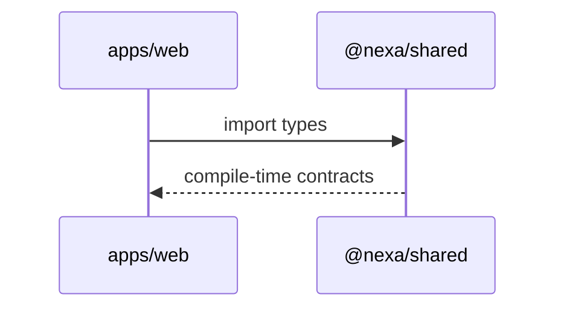

# Module: packages-shared

## 1. Overview
`packages/shared` provides workspace-shared TypeScript contracts used across frontend/backend-adjacent clients, primarily module keys and request scope primitives.

Runtime context:
- Build-time/runtime TypeScript package consumed by other workspace packages

Source references:
- `packages/shared/package.json`
- `packages/shared/src/index.ts`

## 2. Folder Structure & Key Files
- `packages/shared/package.json` — package metadata and lint script.
- `packages/shared/src/index.ts` — exported types (`ModuleKey`, `RegionCode`, `CurrencyCode`, `RequestScope`, `HealthResponse`).

## 3. Public Interfaces
Exported public API from `packages/shared/src/index.ts`:
- `ModuleKey`
- `RegionCode`
- `CurrencyCode`
- `RequestScope`
- `HealthResponse`

Usage points:
- Web declares dependency on `@nexa/shared` (`apps/web/package.json`).
- Next transpiles workspace package (`apps/web/next.config.ts`).

## 4. Data Model
No persistence or ORM model.

Data-contract role:
- Defines shared type-level schema/contracts for module and request context metadata.

Source references:
- `packages/shared/src/index.ts`

## 5. Execution & Control Flow
Typical flow is compile/import-time contract reuse.

Flow references:
- `apps/web/package.json`
- `apps/web/next.config.ts`
- `packages/shared/src/index.ts`

## 6. Configuration
No runtime env configuration in package.

Build/lint configuration:
- Script: `lint` in `packages/shared/package.json`.

## 7. Security & Authorization
No direct auth logic; only type contracts that may be used by security-sensitive code elsewhere.

Source references:
- `packages/shared/src/index.ts`

## 8. Observability
No logging/metrics/tracing logic in this package.

## 9. Testing
No package-local test files detected.

Validation currently occurs via downstream consumer builds/tests:
- `apps/web` typecheck/tests (`apps/web/package.json`).

## 10. Troubleshooting
1. **Import resolution issues** — verify workspace setup (`pnpm-workspace.yaml`) and package name (`@nexa/shared`).
2. **Type mismatch between modules** — confirm shared type changes in `packages/shared/src/index.ts` and consumer updates.
3. **Build transpilation errors in Next** — ensure `@nexa/shared` remains in `transpilePackages` (`apps/web/next.config.ts`).

## 11. Open Questions / TODO
- Scope of shared contracts is currently minimal; confirm whether API DTO sharing is intended to move into this package.
- No explicit versioning/release workflow for internal package changes is documented.
