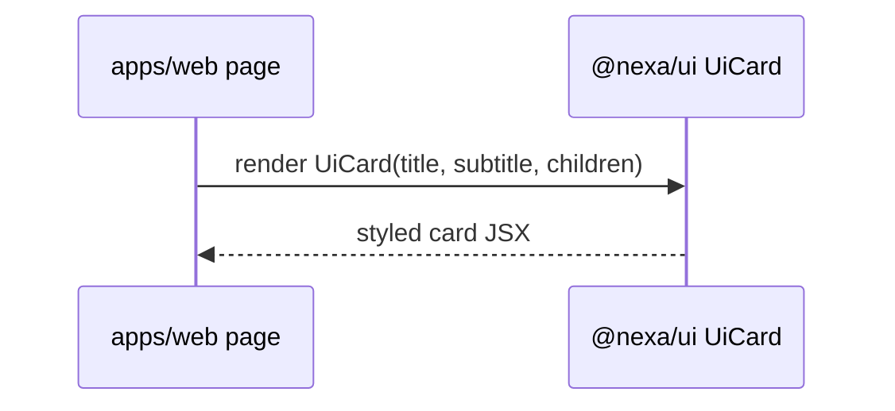

# Module: packages-ui

## 1. Overview
`packages/ui` is a small shared UI package currently exposing a reusable `UiCard` component consumed by the web app.

Runtime context:
- React component package imported by workspace apps

Source references:
- `packages/ui/package.json`
- `packages/ui/src/index.ts`
- `packages/ui/src/components/ui-card.tsx`

## 2. Folder Structure & Key Files
- `packages/ui/package.json` — package metadata, React peer dependency, lint script.
- `packages/ui/src/index.ts` — export barrel.
- `packages/ui/src/components/ui-card.tsx` — card component implementation.

## 3. Public Interfaces
Exported interface:
- `UiCard` component with props `{ title: string; subtitle?: string; children }`
  (`packages/ui/src/components/ui-card.tsx`).

Known usage:
- Launcher page imports `UiCard` in `apps/web/app/page.tsx`.

## 4. Data Model
No database or domain data model; this package only defines React UI primitives.

## 5. Execution & Control Flow
Flow is package import and component render in consuming app.

Flow references:
- `apps/web/app/page.tsx`
- `packages/ui/src/components/ui-card.tsx`

## 6. Configuration
- `peerDependencies.react` set to `^19.0.0` (`packages/ui/package.json`).
- Next transpilation for workspace package enabled in `apps/web/next.config.ts`.

## 7. Security & Authorization
No auth logic in this package.

## 8. Observability
No instrumentation in this package.

## 9. Testing
No package-local tests detected in `packages/ui`.

Downstream validation occurs in web tests/builds where component is consumed.

## 10. Troubleshooting
1. **Component import fails** — verify package path/export barrel (`packages/ui/src/index.ts`).
2. **React version mismatch** — check peer dependency constraints (`packages/ui/package.json`).
3. **Styles not applied as expected** — inspect Tailwind classes in `ui-card.tsx` and consumer app CSS pipeline.

## 11. Open Questions / TODO
- Package currently has one component; clarify intended component-library scope.
- No direct component tests in package; decide whether testing should remain consumer-driven or move into package.
