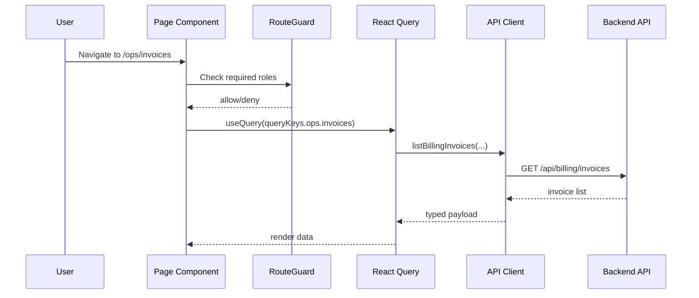

# Module: web

## 1. Overview
The `web` module is a Next.js App Router frontend that renders module hubs and domain pages for Admin, CRM, Sales, Ops, Finance, and reports. It uses a typed API client layer and React Query for server-state fetching.

Runtime context:
- Browser/client-rendered pages (many `"use client"` pages)
- Next.js app runtime with shared root layout/providers

Source references:
- `apps/web/app/layout.tsx`
- `apps/web/app/page.tsx`
- `apps/web/lib/api/core.ts`
- `apps/web/lib/queryKeys.ts`

## 2. Folder Structure & Key Files
- `apps/web/app/layout.tsx` — global shell, app launcher sidebar, provider mounting.
- `apps/web/app/providers.tsx` — React Query client setup.
- `apps/web/app/**/page.tsx` — route pages (52 page routes detected).
- `apps/web/components/module-navigation.tsx` — navigation and module hub links.
- `apps/web/components/route-guard.tsx` — client-side role guard for protected routes.
- `apps/web/lib/api/` — domain API wrappers (`admin.ts`, `catalog.ts`, `revenue.ts`, `subscription.ts`, `billing.ts`, `payments.ts`, `ledger.ts`, `reports.ts`).
- `apps/web/lib/queryKeys.ts` — query key namespaces for crm/admin/sales/ops/finance.
- `apps/web/lib/types.ts` — shared frontend DTO types.

## 3. Public Interfaces
### Routes and Pages
Core hubs and top-level pages:
- `/` launcher (`apps/web/app/page.tsx`)
- `/admin` (`apps/web/app/admin/page.tsx`)
- `/crm` (`apps/web/app/crm/page.tsx`)
- `/sales` (`apps/web/app/sales/page.tsx`)
- `/ops` (`apps/web/app/ops/page.tsx`)
- `/finance` (`apps/web/app/finance/page.tsx`)
- `/reports` (`apps/web/app/reports/page.tsx`)

Ops-specific route set (first-class module requirement):
- `/ops/plans`, `/ops/plans/[id]`
- `/ops/subscriptions`, `/ops/subscriptions/[id]`
- `/ops/invoices`, `/ops/invoices/[id]`
- `/ops/payments`, `/ops/payments/[id]`
- `/ops/journal-entries`, `/ops/journal-entries/[id]`

Source references:
- `apps/web/app/ops/**/page.tsx`
- `apps/web/app/**/page.tsx`

### Major components
- App launcher/sidebar: `apps/web/components/module-navigation.tsx`
- Route access guard: `apps/web/components/route-guard.tsx`
- Home diagnostics widgets: `apps/web/components/auth-dev-token.tsx`, `apps/web/components/health-panel.tsx`, `apps/web/components/sample-form.tsx`
- CRM UI slices: `apps/web/components/crm/*.tsx`

### API client layer
- Core request helper: `apps/web/lib/api/core.ts`
- Domain wrappers: `apps/web/lib/api/*.ts`
- Legacy broad client file still present: `apps/web/lib/api.ts`

### Query/state management
- Query provider: `apps/web/app/providers.tsx`
- Query keys: `apps/web/lib/queryKeys.ts`
- Example module hooks: `apps/web/app/ops/hooks.ts`

### Auth guards / permissions
- Role-based client guard: `apps/web/components/route-guard.tsx`
- Permission utility usage in CRM hub: `apps/web/app/crm/page.tsx`, `apps/web/lib/permissions.ts`

## 4. Data Model
The web module does not own database schema; it consumes typed API DTOs.

Primary data typing and contracts:
- `apps/web/lib/types.ts`
- `apps/web/lib/api/*.ts`
- `packages/shared/src/index.ts`

No local ORM/migration layer in `apps/web`.

## 5. Execution & Control Flow
Core flows:
1. Route rendering under root layout and navigation shell.
2. Route guard evaluates local JWT roles before rendering protected pages.
3. Page-level hooks call API wrappers via React Query and cache with structured keys.
4. Mutations in pages invalidate relevant query keys to refresh lists/detail views.

Flow references:
- `apps/web/components/route-guard.tsx`
- `apps/web/app/ops/hooks.ts`
- `apps/web/lib/queryKeys.ts`
- `apps/web/lib/api/billing.ts`

## 6. Configuration
- Environment variables:
  - `NEXT_PUBLIC_API_BASE_URL`
  - `NEXT_PUBLIC_DEV_TOKEN`
  (`apps/web/.env.example`)
- Next config transpiles workspace packages: `apps/web/next.config.ts`
- Tooling/scripts: `apps/web/package.json`

## 7. Security & Authorization
- Client-side route security via JWT role extraction from local storage token (`apps/web/components/route-guard.tsx`).
- CRM hub action visibility via permission checks (`apps/web/app/crm/page.tsx`, `apps/web/lib/permissions.ts`).
- API calls include bearer token and generated correlation-id (`apps/web/lib/api/core.ts`).
- Final authorization is backend-enforced; frontend guard is UX-level and not security boundary.

## 8. Observability
- Correlation id is attached on outgoing API calls (`apps/web/lib/api/core.ts`).
- Error handling preserves correlation id from backend envelope (`apps/web/lib/api/core.ts`, `apps/web/app/ops/hooks.ts`).
- No dedicated frontend telemetry pipeline is configured in current sources.

## 9. Testing
Structure:
- Route/hub smoke tests: `apps/web/app/route-hubs.test.ts`, `apps/web/app/sales/routes.smoke.test.ts`, `apps/web/app/ops/routes.smoke.test.tsx`
- Flow tests: `apps/web/app/sales/quotes.flow.test.ts`, `apps/web/app/ops/ops.flow.test.tsx`
- Component tests: `apps/web/components/crm/admin/**/*.test.ts*`
- Utility tests: `apps/web/lib/*.test.ts`

Run commands:
- `pnpm --filter @nexa/web test`
- `pnpm --filter @nexa/web typecheck`
- `pnpm --filter @nexa/web lint`
(`apps/web/package.json`, root `package.json`)

## 10. Troubleshooting
1. **Page blocked unexpectedly** — inspect token payload roles and `RouteGuard` logic (`apps/web/components/route-guard.tsx`).
2. **API 401/403 in UI** — verify token storage key and backend role requirements (`apps/web/lib/api/core.ts`, backend route files).
3. **Data not refreshing after mutation** — validate query-key invalidation path (`apps/web/lib/queryKeys.ts`, page mutation handlers).
4. **Wrong API target** — confirm `NEXT_PUBLIC_API_BASE_URL` (`apps/web/.env.example`, `apps/web/lib/api/core.ts`).
5. **Hydration/client behavior mismatch** — many pages are client components; verify `"use client"` usage in route files.
6. **Missing route in launcher** — check `apps/web/components/module-navigation.tsx`.
7. **Vitest not picking files** — see include pattern in `apps/web/vitest.config.ts` and custom vitest configs present in repo.

## 11. Open Questions / TODO
- `apps/web/lib/api.ts` and `apps/web/lib/api/*.ts` overlap partially; confirm long-term consolidation strategy.
- Client-side route guard is role-only and based on local token decode; validate whether server-side route enforcement is planned for SSR paths.
- Multiple vitest config files exist (`vitest-finance.json`, `vitest-sales*.json`, `vitest.json`); document intended usage matrix.
